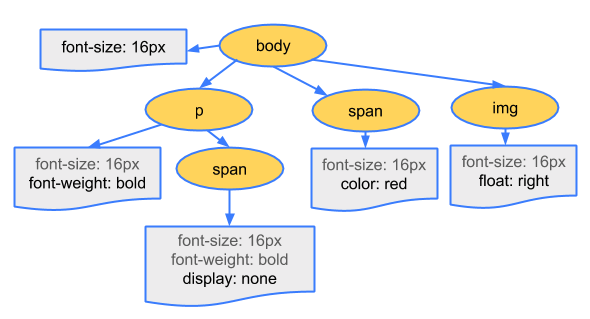

이 블로그 템플릿에는 우측 상단에 dark theme, light theme를 **switch 할 수 있는 기능**이 있습니다. 구현을 궁금해하시는 분들이 계실 것 같아서 하나의 포스팅으로 작성해봤습니다.

## CSS

CSS는 **Cascading Style Sheets** 의 약자입니다. 적절한 이름이 아니라고 생각하시는 분도 계시던데, 저는 언어의 **역할**과 그 **특성**을 굉장히 잘 살린 이름이라고 생각합니다.
CSS라는 언어가 스타일링(styling)이 주 목적이다 보니 대부분 **Style Sheets**에만 집중하게 됩니다. 물론 스타일링 한다는 부분도 중요하지만 정의한 스타일이 적용되는 원리에 있어서는 **Cascading**이란 부분이 더 중요합니다.

### Cascading ?

사전적 정의로는 **pour downward rapidly and in large quantities**라는 뜻을 가지고 있습니다. **‘위에서부터 내려오면서 순차적으로 적용됨’**으로 해석할 수 있습니다. 즉 `body` 요소의 하위 요소인 경우 `body`에 적용된 스타일이 하위 요소에도 적용됨을 의미합니다.

이러한 특성을 좀 더 활용하면 상위에 어떠한 스타일 값이 정의되었더라도 하위에서 해당 정의를 다른 값으로 재정의(override)가 가능합니다.

### CSSOM



브라우저가 HTML 코드를 parsing 하여 HTML node 트리(DOM)를 생성하는데, 이 때 `link` 태그로 추가되어 있는 CSS 코드를 기반으로 CSSOM을 생성하게 됩니다. CSSOM 또한 DOM과 마찬가지로 트리 구조를 갖습니다. 이 트리 구조를 따라 cascading 원리가 적용됩니다.

지금부터 작은 예제를 통해 스타일링에만 집중한 CSS 코드와 Cascading 원리를 활용한 코드를 살펴보겠습니다.

## Just Styling

```css
.box {
  width: 200px;
  height: 200px;
  background-color: red;
}
```

`.box`라는 선택자를 갖는 태그에 스타일을 추가했습니다. 아래 코드에서는 `background-color`를 동적으로 변경시키고자 별도 선택자로 스타일을 분리했습니다.

```css
.box {
  width: 200px;
  height: 200px;
}
.box.red {
  background-color: red;
}
.box.blue {
  background-color: blue;
}
```

`box`와 `red` 클래스를 갖는 엘리먼트는 빨간 상자가 될 것이고 `box`와 `orange` 클래스를 갖는 엘리먼트는 파란 상자가 될 것 입니다.

여기까지는 좋습니다. 그런데 애플리케이션의 (또는 웹 사이트의) 전체 테마를 바꿔주기 위해서는 `background-color`를 비롯하여, 여러 엘리먼트의 색상을 변경해줘야 합니다. 위와 같은 방법으로 색상을 관리하는 선택자를 토글(toggle)하는 방법으로 구현한다면 코드는 다음과 같아 집니다.

```css
.wrapper.dark {
  /* 어두운 배경색 적용 */
}
.wrapper.light {
  /* 밝은 배경색 적용 */
}
.header.dark {
  /* 밝은 글씨 */
}
.header.light {
  /* 어두운 굴씨 */
}
/* ... */
```

여기까지도 좋습니다. 테마를 바꾼다는 것은 색상을 바꾸는 것이니 별도 선택자로 관리하는 것이 맞습니다. 그러나 테마를 변경해야 하는 순간, 색상을 변경해줘야 하는 모든 Component들의 선택자(class)를 변경해줘야 합니다. 테마에 따라 스타일링이 필요한 모든 컴포넌트에서 다음 `Foo`엘리먼트와 같은 상황이 발생할 겁니다.

```js
export const Foo = ({ theme }) => {
  // do something...
  const isDarkTheme = theme === 'dark'

  return <div className={isDarkTheme ? 'dark' : 'light'} />
}
```

생각만해도 끔찍한 [props drilling](https://blog.kentcdodds.com/prop-drilling-bb62e02cb691)이 발생하게 됩니다. 😞 React Application을 능숙하게 다루시거나 상태 관리에 대해 공부를 해보신 분들이라면 다음과 같이 반문할 수도 있습니다.

1. 무슨 소리냐! 넌 Redux도 모르냐! 😡
2. React에 Context API가 있는 것을 모르냐! 😡

다 좋은 방법입니다! 하지만 `{isDarkTheme ? 'dark' : 'light'}` 이 코드가 스타일링이 필요한 모든 컴포넌트에 들어가는 것은 피할 수 없습니다. 분명 더 좋은 방법이 있을 겁니다.

## 다시, Cascading

서론이 길었습니다. 우선 박스 엘리먼트를 보다 효율적인 CSS 코드로 변경합시다. CSS가 적용되는 원리를 다시 생각해봅시다. 상위 엘리먼트의 선택자를 기반으로 하위 엘리먼트의 색상을 변경할 수 있지 않을까요? 다음과 같이 말입니다.

```css
div.red .box {
  background-color: red;
}

div.blue .box {
  background-color: blue;
}
```

여러 `.box` 엘리먼트의 상위 태그인 `div`태그에 `red` 선택자가 있다면, `background-color`가 `red`. `blue` 선택자가 있다면 `blue` 색상을 적용하는 코드입니다. 실제 Codepen에서 해보실 수 있습니다. [Codepen - Cascading Example](https://codepen.io/Jbee/pen/XOQjrZ)

이제 감이 좀 잡히셨나요? 위 `dark`, `light` 클래스로 덕지 덕지 붙어있던 CSS 코드를 변경해봅시다.

### Control classes of body

적용하고자 하는 테마의 색상과 관련된 클래스는 어디서 제어하면 좋을까요? 방금 전의 예제에서는 색상 변경을 제어할 엘리먼트의 **공통 부모**에 적용했습니다. 저희는 애플리케이션 전체에 테마를 적용해야 하기 때문에 `body` 태그에서 제어하도록 합시다. 모든 엘리먼트의 부모가 되니 문서 전체에 테마를 한 번에 적용할 수 있습니다.

```css
body.dark .wrapper {
  /* 어두운 배경색 적용 */
}
body.light .wrapper {
  /* 밝은 배경색 적용 */
}
body.dark .header {
  /* 밝은 글씨 */
}
body.light .header {
  /* 어두운 굴씨 */
}
```

(이전 코드와 비교해보세요!) 모든 엘리먼트에 퍼져있던 것이 **선택자를 제어하는 부분**이 `body` 태그의 클래스 하나만 토글시켜주면 모든 색상이 적용되도록 변경해줬습니다.

하지만 아직도 수많은 **중복**이 보입니다. `body.red`, `body.blue`가 계속해서 중복되고 있습니다. 또 여기서 테마가 하나라도 더 추가된다면? `body.[color]`라는 상위 엘리먼트에 대하여 하위 엘리먼트들의 색상 값을 하나 하나 지정해줘야 합니다.

## CSS Variables

CSS에서도 변수를 선언할 수 있습니다. 우리는 중복으로 명시된 이 색상들을 변수로 관리할 수 있습니다. [MDN CSS Custom properties](https://developer.mozilla.org/en-US/docs/Web/CSS/--*)

```css
body.red {
  --bg: red;
  --border-color: gray;
  --header-text-color: orange;
}
body.blue {
  --bg: blue;
  --border-color: white;
  --header-text-color: skyblue;
}
```

선언된 `--bg`, `--border-color`, `--header-text-color` 등의 변수 값은 `body` 태그에 `red` 클래스가 붙어있냐 `blue` 클래스가 붙어있느냐에 따라 달라집니다.

이렇게 정의한 변수를 각각의 엘리먼트에서 바로 사용만 해주면 됩니다.

```css
.wrapper {
  background-color: var(--bg);
}
.header {
  color: var(--header-text-color);
}
```

코드가 아주 심플하고 깔끔해졌습니다. (Awesome! 😊 )

### SASS


아쉽게도 앞서 소개드린 CSS variables은 IE11을 지원하지 않습니다. ([Can I use - CSS variables](https://caniuse.com/#search=css%20variable)) 대신 저희는 [SASS](https://sass-lang.com/)를 사용할 수 있습니다. 이미 많은 개발자들이 사용하고 있는 CSS 전처리기 중 하나입니다.

제 블로그 템플릿의 기반은 Gatsby에서는 [gatsby-sass-plugin](https://www.gatsbyjs.org/packages/gatsby-plugin-sass) 플러그인 하나만 추가해주면 바로 사용할 수 있습니다. SASS의 인기가 높은지, CRA 2.0 version에서는 default로 추가해줬습니다.

SASS에서는 여러 가지 기능이 있기 때문에 여러 가지 방법으로 theme에 따라 스타일링 해줄 수 있습니다. 변수 선언도 물론 가능하고, mixin을 통해서 스타일링 할 수도 있습니다.

## Toggle theme!

이젠 `body`의 클래스를 컨트롤(클래스를 theme status 값에 따라 설정)하는 컴포넌트만 있으면 됩니다. 테마 변경에 따른 외부 변경이 `body` 엘리먼트의 클래스 뿐이기 때문에 이 테마 스위칭을 위한 엘리먼트는 완전히 닫힌 컴포넌트가 됩니다.

> :gift: 이 스위치 엘리먼트를 적용하기 위해 [react-switch](https://github.com/markusenglund/react-switch)라는 라이브러리를 사용했습니다.

### Conclusion

애플리케이션 또는 웹 사이트에 테마를 추가하는 간단한 예제를 통해서 CSS의 아주 기본적인 원리에 대해 알아봤습니다. 감사합니다.

### Reference

- [MDN CSS Custom Properties](https://developer.mozilla.org/en-US/docs/Web/CSS/--*)
- [Google Web Fundamentals - Critical Rendering Path](https://developers.google.com/web/fundamentals/performance/critical-rendering-path/constructing-the-object-model)
